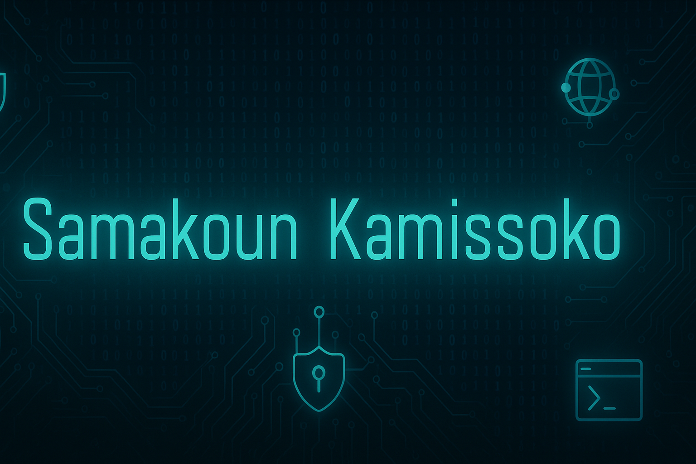

  

<h1 align="center">Salut 👋, je suis Samakoun Kamissoko</h1>

  Futur ingénieur en cybersécurité | Passionné par les réseaux, l’IA & les systèmes complexes

  
  
  
  

---

## 🔍 À propos de moi

🎓 Étudiant en informatique au Maroc, passionné par la **cybersécurité**, les **réseaux avancés** et l’**intelligence artificielle**.  
💡 Mon objectif : Fusionner **sécurité réseau** et **IA** pour bâtir des systèmes robustes et intelligents.

---

## 💼 Compétences techniques

- 🧠 **Cybersécurité** : IDS, pare-feux, VPN, ethical hacking, gestion des vulnérabilités
- 🌐 **Réseaux** : IPv4/IPv6, Cisco, routage statique/dynamique, Wireshark
- 💻 **Programmation** : Python, Java, C, C++, JEE
- 🗃️ **Bases de données** : PostgreSQL, MongoDB
- 🔧 **Outils** : Git, Linux (Ubuntu/Kali), Cisco Packet Tracer, VS Code, Docker (bases)

---

## 🚀 Projets récents

- 🔒 **IDS intelligent basé sur le machine learning** (PFE)
- 🧭 **Simulation de topologies IPv6** sous Cisco Packet Tracer
- 📊 **Analyse réseau avancée avec Wireshark**
- 🔧 *Et bien d’autres sur mon GitHub*

---

## 🛠️ En préparation

- 🎓 Formation en **cybersécurité offensive**
- 💡 Projets open-source : automatisation d’analyses réseau
- 💬 Contributions à la communauté **infosec francophone**

---

## 🌐 Me retrouver ailleurs

- [🔗 LinkedIn](https://www.linkedin.com/in/samakoun-kamissoko-a25248355)
- 📧 Email : sk7706688@gmail.com

---

## 💬 Citation favorite

> *"Le savoir est une arme. Je suis ici pour en faire mon armure."* – S.K.

---

  🙏 Merci pour votre visite !

